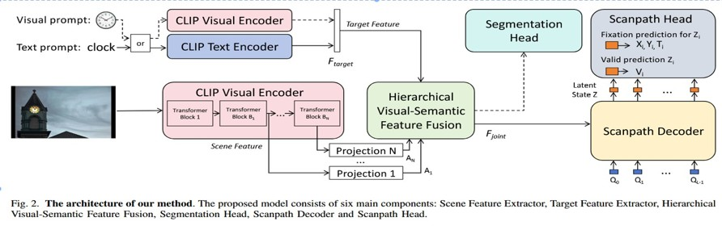

# CLIPGaze: Zero-Shot Scanpath Prediction (Adapted for IA: Case Studies)

This repository contains an adapted implementation of **CLIPGaze**, a model for Zero-Shot Goal-Directed scanpath prediction. 

This project was developed for the course *IA: Case Studies*. It builds upon the original work by *Lai et al.* but introduces modifications regarding batch processing, data handling, and specific model testing.

## Project Overview

Goal-directed scanpath prediction aims to predict people's gaze shift path when searching for objects in a visual scene. The core idea of CLIPGaze is to utilize **CLIP** to extract pre-matched features for the target prompt and input image, enhancing generalization for zero-shot settings.

### Model Architecture


## Key Contributions & Modifications

While the core logic is based on the original CLIPGaze repository, the following adaptations were made for this project:

### 1. Batch Processing & Notebook Refactoring
* **Original Code:** Processed images one by one.
* **My Modification:** Based on a notebook provided by **Ir. Adrien KINART**, I significantly refactored the pipeline to support **batch processing**. The model can now ingest and process multiple images in one run, improving the ease of analyzing larger datasets.

### 2. Experimental Data & Scope
* **Scope:** All experiments in this repository focused exclusively on the **Target Present (TP)** condition.
* **Dataset Expansion:** Tested the model on new data subsets to evaluate robustness: 
    * A part of the *Figurines* dataset (from [lerf.io](https://www.lerf.io/)).
    * Images of everyday life.
    * Rasterized images from the *Figurines* dataset.

### 3. Hardware & Model Implementation
* **Model Selection:** Initial attempts were made using smaller model variants like *ViT-B/16* to optimize for local resources instead of *ViT-L/14@336px*. However, due to GPU memory constraints, these did not yield successful runs locally.
* **Computing Resources:** The final experiments using the larger, standard model were successfully executed on the computer in the **Numédiart lab**.

### 4. Analysis of Results
The processed scanpaths are stored in the `results` folder, organized according to the type of image (*Figurines*, "everyday life", or rasterized). 

**Observations:** It became clear that the weights used for the model were not built to handle figurines. As a consequence of the training on **COCO-Search18**, the model's predictions are far from the target for figurine images. The gaze prediction also degrades significantly when there are multiple representations of the given target in the scene.

---

## Installation

It is recommended to use Conda to manage dependencies.

```bash
# Create the environment
conda create -n CLIPGaze python=3.8.5
conda activate CLIPGaze

# Install dependencies
bash install.sh
```


### Critical Compatibility Warning
Please pay close attention to the compatibility between **CUDA, Python, PyTorch, and your specific GPU version**. Mismatches here are the most common cause of errors.
* Check the [PyTorch Get Started locally](https://pytorch.org/get-started/locally/) guide to ensure you install the correct version for your hardware.

---

## Required Files

### Model Weights
To run the inference, you must download the pre-trained weights. raining the model from scratch is possible but would require significant time, data, and computational resources beyond the scope of this project
You can download the **traditional target present** model weights from this link:
 [Google Drive Link](https://drive.google.com/drive/folders/1CO7OSwEy8dn3xPkexi3ZfcaAOOS_ecpr?usp=sharing)

*Note: For this project, you only need to download the **Target Present** weights.*

---

## Credits & Acknowledgements

* **Original Work:** [CLIPGaze Repository](https://github.com/cvlab-stonybrook/Gazeformer) by Lai et al.
* **Support:** Special thanks to **Ir. Adrien KINART** for the foundational notebook, his generous assistance with the project, and for taking the time to explain the mechanics of such an architecture.
